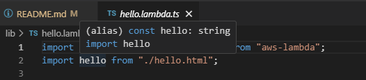
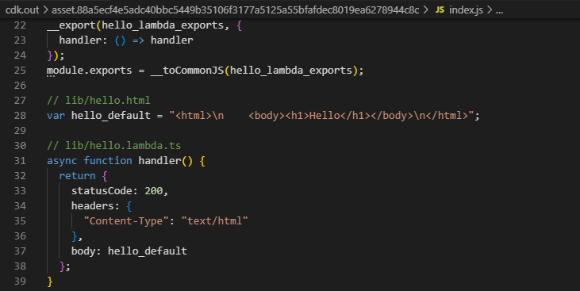
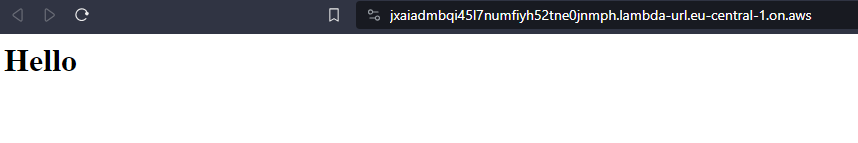

# AWS CDK Prototype: Importing text files in NodejsFunctions

This AWS CDK stack, defined in `aws-cdk-proto-lambda-html-load-stack.ts`, sets up a Lambda function that serves HTML content. The Lambda function is created using the `NodejsFunction` construct with a custom bundling option to include `.html` files as text. It also exposes a public URL through the `FunctionUrl` construct with no authentication required, allowing easy access to the function's response. The URL of the Lambda function is exposed as a CloudFormation stack output.

This works fine with the IDE intellisense:

The HTML file is included in the synthesized stack:

And, once deployed, the HTML file is indeed loaded and returned by the Lambda:

